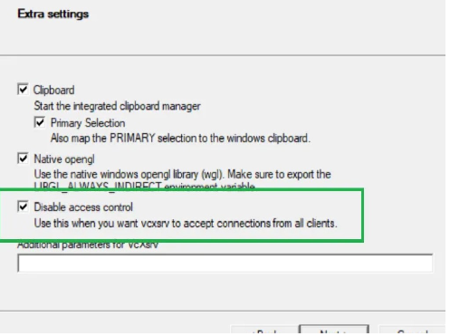
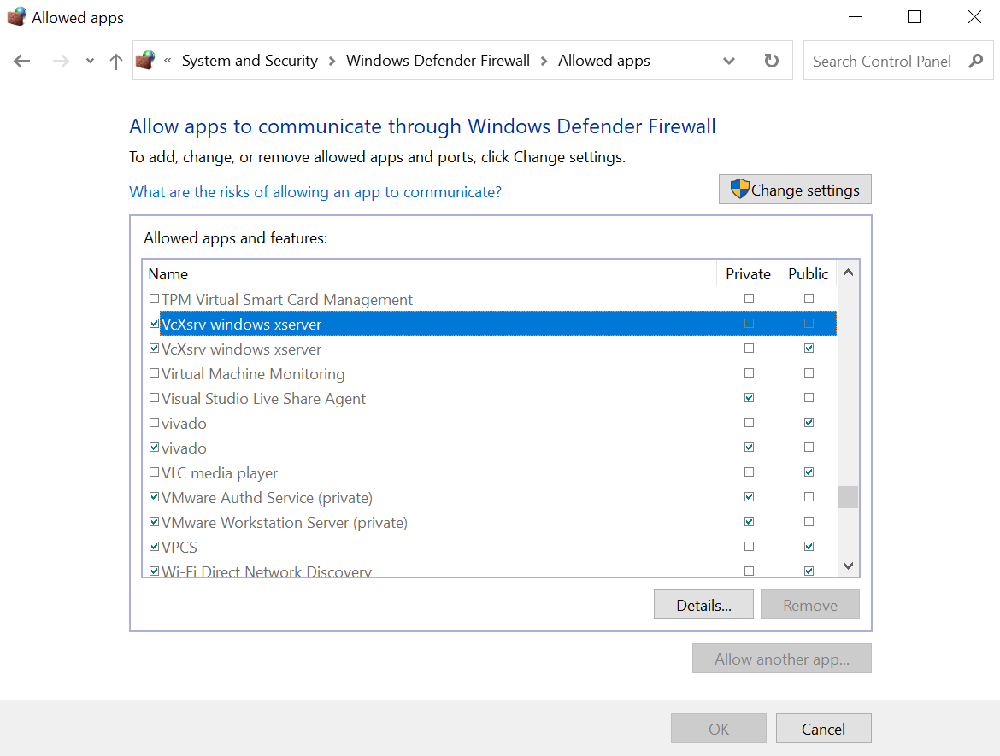
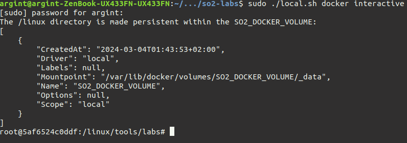

# SO2 实验室辅助基础设施

本仓库包括一个脚本，用于启动一个 Docker 容器，该容器配备有编译好的 [Linux 内核](https://github.com/linux-kernel-labs/linux)，用于 SO2 实验。

# 快速开始

要启动 Docker，请运行以下命令：

```bash
# 如果在 Linux 上运行
$ sudo ./local.sh docker interactive --privileged
# 如果在 WSL 上运行
$ sudo ./local.sh docker interactive
```

如果出现错误，请参阅[如何解决错误](#如何解决错误)。

> **Warning**
> 第一次运行上述命令时，会花费一些时间，因为脚本将从[注册表](https://gitlab.cs.pub.ro/so2/so2-assignments/container_registry)中获取镜像。如果你直接在物理机上运行 Linux，则借助 `--privileged` 参数你可以使用 KVM。

成功执行该命令后，你将看到 Docker shell 提示：


请注意，在 Docker 环境中的 `/linux` 目录会挂载到 Docker 卷，以确保在 `/linux` 目录中进行的任何修改都会持久保存（即使容器停止）。此外要注意，在 Docker 环境中的工作目录是 `/linux/tools/labs`。这个目录是我们编译模块和启动虚拟机的地方。你至少需要两个 Docker 内部的终端。一个用于编译，一个用于虚拟机控制台。建议使用 `tmux`（查看 [TMUX 速查表](#tmux-速查表)小节）。你只需输入以下命令：

```bash
$ tmux
```

你应该会看到类似的输出：


要为当前实验生成骨架，请执行以下命令，注意将 `<实验名称>` 替换为相应的实验名称：

```bash
$ LABS=<实验名称> make skels
```

接下来，要启动 SO2 虚拟机，只需运行：

```bash
make console
```

你可能需要等待几秒钟。记得使用 `root` 用户名登录。

如果一切顺利，你应该会看到类似的内容：


在上面的窗格中，我们在虚拟机内操作，在下面的窗格中，我们在 Docker 内操作。`skels` 目录在 Docker 容器和虚拟机之间共享。我们的工作流程包括在 Docker 内构建模块，然后通过 `insmod` 命令将它们插入虚拟机，或者通过 `rmmod` 将它们移除。要启动模块构建过程，请在 Docker 内运行以下命令：

```bash
$ make build
```

> **Warning**
> 每次构建模块时，你**无需**重新启动虚拟机。但是，如果你想停止虚拟机，请先按下组合键 `Ctrl + A`，然后按下 `q`。

# 使用 qemu 显示启动虚拟机（在 Docker 内）

使用以下命令启动 Docker：

```bash
$ sudo ./local.sh docker interactive --allow-gui
```

> **Warning**
> 如果你正在使用 WSL，请在启动虚拟机之前按照以下步骤进行操作！

（在 Docker 内）使用以下命令启动虚拟机：

```bash
make gui
```

只有在 WSL 上，我们才需要安装 X11 服务器：从[这里](https://sourceforge.net/projects/vcxsrv/)下载并运行安装程序。安装完成后，运行 XLaunch 应用程序，并确保选中以下复选框。务必确保 XLaunch 应用程序正在运行！



还有，要确保在 Windows 防火墙管理器中选中了 VcXsrv 的两个复选框。



现在，你应该可以运行 `make gui` 命令了。

> **Warning**
> 就像使用 `make console` 时一样，每次构建模块时**无需**重新启动虚拟机。但是，如果你想停止虚拟机，请按下组合键 `Ctrl + A`，然后按下 `q`（在控制台中按下，而不是在 qemu 显示中）。要释放处于 qemu 显示区域的鼠标，请使用 `Ctrl + Alt + g`。

# 使用 VIM + CSCOPE 搜索符号

在 Docker 镜像中编译的内核还包含一个 cscope 数据库，你可以使用 vim 来利用其进行符号搜索。TODO：添加命令

# 使用 VSCode

尽管我们爱 `vim`，但它并不是唯一的编辑器。如果你需要更加高级的编辑器，可以使用 VSCode。为了使用 VSCode，我们有两种方法，你需要访问 `/linux` 树所挂载的目录。

## 选项 1（适用于 WSL 和 Linux）

在 VSCode 中安装 `Dev Containers` 和 `WSL` 扩展，连接到容器，并打开 `/linux` 目录。

## 选项 2（适用于 Linux）

打开主机上的卷挂载点。当你执行 `local.sh` 脚本时，这些信息将显示在开头。



你可能需要以 `root` 用户身份启动 VSCode：

```bash
sudo code --no-sandbox --user-data-dir /root
```

之后，你只需要打开上面在“Mountpoint”字段中列出的目录。在本情况下，它是 `/var/lib/docker/volumes/SO2_DOCKER_VOLUME/_data`。

# TMUX 速查表

* 垂直分割： `Ctrl + b` 然后 `SHIFT + %`
* 水平分割： `Ctrl + b` 然后 `SHIFT + "`
* 切换到面板： `Ctrl + b` 然后使用方向键
* 删除面板： `Ctrl + d`
* 放大面板： `Ctrl + b` 然后 `z`
* 缩小面板： `Ctrl + b` 然后 `z`

# 如何解决错误

* 如果 `./local.sh docker interactive` 看起来阻塞了，考虑终止它（CTRL + c）并重新运行
* 如果 `/linux/tools/labs` 目录是空的，请考虑删除卷并重新运行脚本：

```bash
$ docker volume rm SO2_DOCKER_VOLUME
$ ./local.sh docker interactive
```

* 如果尝试在 WSL 上运行脚本时遇到“bad interpreter”错误，请参考[这个链接](https://stackoverflow.com/questions/14219092/bash-script-bin-bashm-bad-interpreter-no-such-file-or-directory)
* 如果遇到其他意外问题，请考虑重新启动容器。
