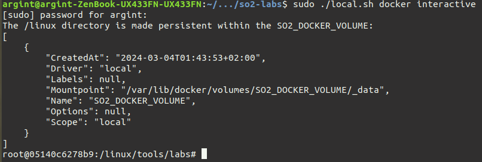
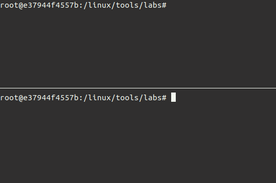
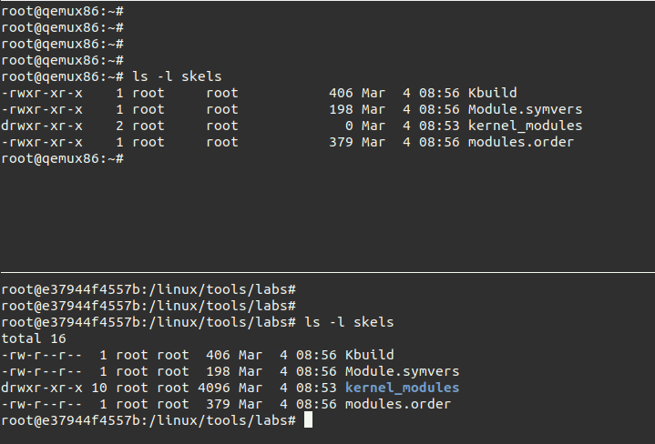

# SO2 laboratory auxiliar infrastructure
The provided repository includes a script for launching a Docker container equipped with a compiled [Linux Kernel](https://github.com/linux-kernel-labs/linux), as utilized in the SO2 laboratories.

# Quick Start
To start the Docker simply run
```
# If you run on Linux
$ sudo ./local.sh docker interactive --privileged
# If you run on WSL
$ sudo ./local.sh docker interactive 
```

If errors occur please see  [How to solve errors](#how-to-solve-errors)

> **Warning**
> The first time you use the previous command it will take a while because the script will pull the image from the [registry](https://gitlab.cs.pub.ro/so2/so2-assignments/container_registry).
> The `--privileged` argument allows the use of KVM if you're runing Linux natively.

Upon successful execution of the command, you will be presented with a Docker shell prompt:



Note that the `/linux` directory within the Docker environment is mounted to a Docker volume, ensuring that any modifications made within the `/linux` directory persist (even if you stop the container).
Also, it's important to note that the working directory within the Docker environment is `/linux/tools/labs`.
This directory is where we will compile modules and start the Virtual Machine.
You will need at least two terminals inside the Docker.
One for compiling, and one for the Virtual Machine console.
For this we recommend `tmux` (Go to section [TMUX cheatsheet](#tmux-cheatsheet)).
Simply type the following command:
```
$ tmux
```

You should see a similar output:



To generate the skeleton for the current laboratory, simply execute the following command, replacing `<lab_name>` with the corresponding laboratory name:
```
$ LABS=<lab name> make skels
```

Next, to start the SO2 VM simply run:
```
make console
```
You might need to wait a few seconds.
Use the `root` username for logging in.

If everything went well you should see something similar:



In the upper pane, we're operating within the VM, while in the lower pane, we're inside Docker.
The `skels` directory is shared between the Docker container and the VM.
Our workflow involves building modules within Docker and then inserting them to the virtual machine via `insmod` or removing them via `rmmod`.
To initiate the module building process run the following command inside the Docker:
```
$ make build
```

> **Warning**
> You DO NOT need to reboot the VM each time you build modules.
> But if you want to stop the Virtual Machine use the following key combination `Ctrl + A then q`.

# TMUX cheatsheet

* Vertical Split: `Ctrl + b then SHIFT + %`
* Horizontal Split: `Ctrl + b then SHIFT + "`
* SWitch to pane: `Ctrl + b then Arrow Keys`
* Deleting pane: `Ctrl + d`
* Zoom in pane: `Ctrl + b then z`
* Zoom out pane: `Ctrl + b then z`

# How to solve errors

* If `./local.sh docker interactive` seems to block, consider killing it (CTRL + c) and rerun it
* If the `/linux/tools/labs` directory is empty consider removing the volume and rerun the script:
```
$ docker volume rm SO2_DOCKER_VOLUME
$ ./local.sh docker interactive
```
* If you encounter the "bad interpreter" error while attempting to run a script on WSL try [this](https://stackoverflow.com/questions/14219092/bash-script-bin-bashm-bad-interpreter-no-such-file-or-directory)
* If you encounter any other unexpected issues, consider restarting the container.